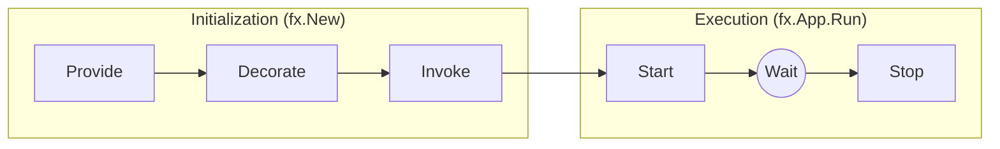
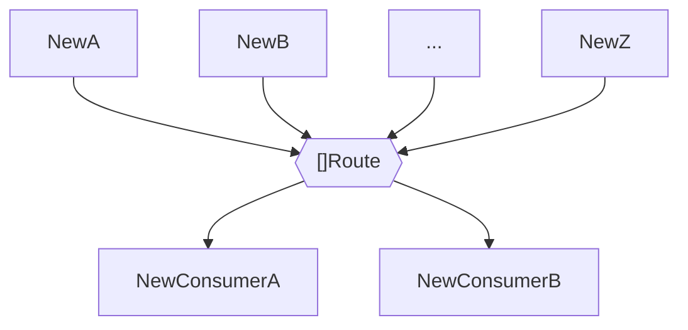

# [FX](https://uber-go.github.io/fx/)

## Lifecycle


- fx.Provide
- fx.Decorate
- fx.Invoke
- fx.App.Start / fx.Hooks.OnStart
- fx.App.Stop / fx.Hooks.OnStop

## Modules

Build app from modules graph `app = fx.Module(fx.Module...)`


## Constructors

```go
var object Object
options := fx.Provide(
    // Базовые конструкторы
    func (inParams) (outParams, error) {},
    // Конструктор на осонве уже существующего объекта
    fx.Supply(Object{}),
    // Аналог Supply, инициализации объекта из графа 
    fx.Populate(&object),
    // Аннотация
    fx.Annotate(
        consructor,
		fx.As(new(Interface)), // от частного к общему
        fx.ParamTags(`name:"fzz" optional:"true"`, `name:"bzz"`),
        fx.ResultTags(`name:"bar"`, `group:"routes"`),
        fx.OnStart(func (p OnStartParams) {...}),
        fx.OnStopt(func (p OnStopParams) {...}),
    ),
    fx.Annotate(
        consructor, // return Interface
        fx.From(new(*impl)), // от обобщего к частному
    ),
    // Оболочка над определенным типом
    fx.Decorate(func (SomeInterface, ...anotherDependencies) (SomeInterface, error)),
    // Область видимости
    fx.Private,
    // Обработка ошибок
    fx.ErrorHook(...handlers),
)
```

## Param Objects

```go
type inParams struct {
  fx.In
  inputObjects *Object `optional:"true"`
}

type outParams struct {
  fx.Out
  outputObjects *Object `group:"[groupname],soft,flatten"` // optional group
}

func New(inParams) (outParams, error) {}
```

## Groups & Names


`groups` - группируют обекты по признаку
`name` - выделяют объекты из группы однотипных
