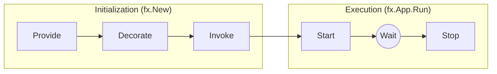
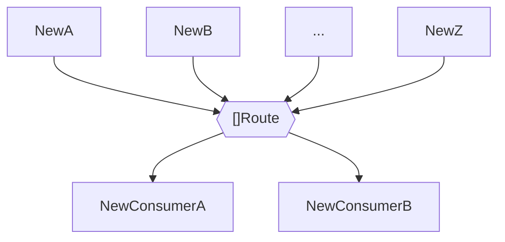
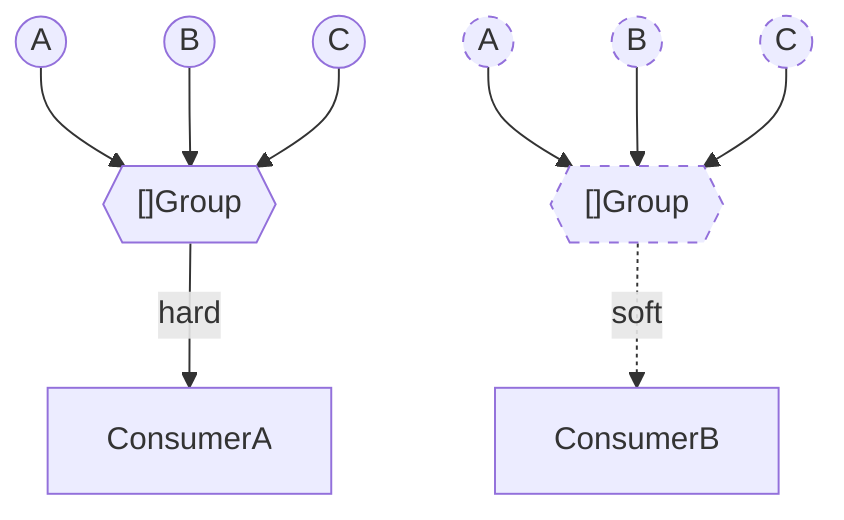
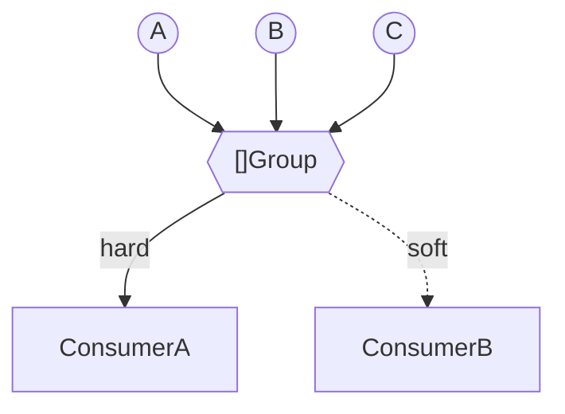

# Uber-FX DI

- [Docs](https://pkg.go.dev/go.uber.org/fx)
- [Git](https://github.com/uber-go/fx)
- [Homepage](https://uber-go.github.io/fx/)

## Lifecycle



## Modules and Options

```go
// План для посроения графа зависимомтей приложения
options := fx.Options(OtherModulesOrOptions...)
// Именнованные опции
options := fx.Module("name", OtherModulesOrOptions...)

// Огранисения на время запуска (Start) и остановки (Stop) програмы
startOption := fx.StartTimeout(time.Duration)
stopOption := fx.StopTimeout(time.Duration)

// Логирование (для настройки логов fx - необходимо сконфигрурировать zap.Logger)
logOption := fx.WithLogger(func(...) fxevent.Logger {
    zapLogger := ...
    return &fxevent.ZapLogger{Logger: zapLogger}
}),
```


## Constructors

```go
var object Object
options := fx.Provide(
    // Базовые конструкторы
    func (inParams) (outParams, error) {...},
    
    // Конструктор на осонве уже существующего объекта
    fx.Supply(Object{}), // Создает узел графа с типом переданного объекта
    // Аналог Supply, инициализации объекта из графа 
    fx.Populate(&object),
    
    // Аннотация
    fx.Annotate(
        consructor,
        
        // Декораторы
        fx.As(new(Interface)), // от частного к общему
        fx.From(new(*impl)), // от обобщего к частному
        
        // Теги
        fx.ParamTags(`name:"fzz" optional:"true"`, `name:"bzz"`),
        fx.ResultTags(`name:"bar"`, `group:"routes"`),

        // Хуки
        fx.OnStart(fx.HookFunc),
        fx.OnStopt(fx.HookFunc),
    ),
    
    // Оболочка над определенным типом
    fx.Decorate(func (SomeInterface, ...anotherDependencies) (SomeInterface, error)),
    // Замена определенного типа
    fx.Replace(func (SomeInterface, ...anotherDependencies) (SomeInterface, error)),
    
    // Область видимости (опция fx.Provide)
    fx.Private,
    // Обработка ошибок
    fx.ErrorHook(...handlers),
)
```

## Param Objects

```go
type inParams struct {
    fx.In
    inputObject *Object `name:"[name]" group:"[groupname]"`

    // fx.In only
    inputObjects ...Object `group:"[groupname],soft"`
    inputObject *Object `optional:"true"`
}

type outParams struct {
    fx.Out
    outputObject *Object `name:"[name]" group:"[groupname]"`

    // fx.Out only
    outputObjects []Object `group:"[groupname],flatten"`
}

func New(inParams) (outParams, error) {}
```

## Groups & Names


`groups` - группируют обекты по признаку  
`name` - выделяют объекты из группы однотипных

### Soft/Hard group



