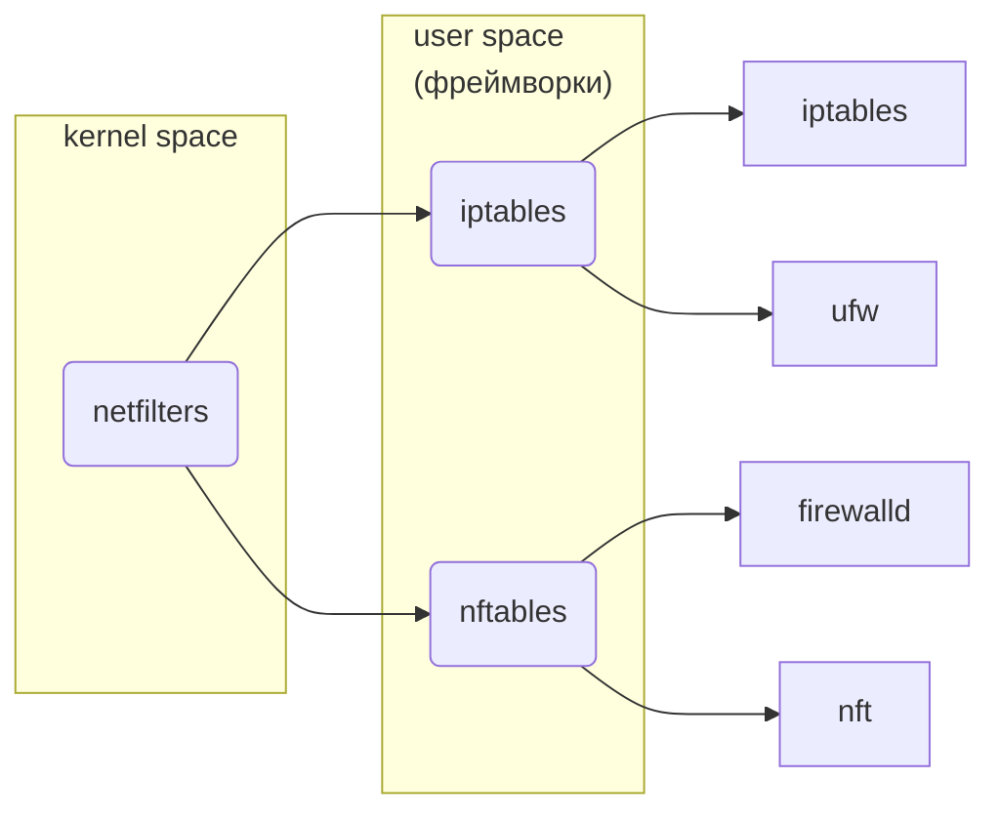

# Distributives
- [artix](https://artixlinux.org/)
- [alt](https://www.altlinux.org/)
- [linux-hardware](https://linux-hardware.org/)

# GNU Utils

## Core utils
- lsblk | lscpu | lspci | lsusb | ...
- fuser
- type | which  | command | hash
- cal | date
- strace | rtrace | autrace
- watch
- time -> [hyperfine](https://github.com/sharkdp/hyperfine)
- grep -> [ugrep](https://github.com/Genivia/ugrep)
- [core utils in rust](https://github.com/uutils/coreutils)
- xargs | [parallel](https://www.gnu.org/software/parallel/)

### Shells
- sh -> bash -> zsh -> [fish](https://fishshell.com/)
- jobs | bg | fg
### Search
find -> fd -> fzf
### Docs
- apropos (search manual pages) | `man -k` | `man --apropos`
- man | info | help (shell specific)  -> [batman](https://github.com/eth-p/bat-extras/blob/master/doc/batman.md)
- [tldr](https://tldr.sh/) | https://command-not-found.com/

## Files
- echo | printf

### pdf-reader
- [zathura](https://pwmt.org/projects/zathura/) -> [zaread](https://github.com/paoloap/zaread)

## File System (FS)
- ls -> [exa](https://github.com/ogham/exa) | [lsd](https://github.com/lsd-rs/lsd)
- tree -> [broot](https://github.com/Canop/broot)
- [mc](https://midnight-commander.org/wiki)
- cd -> [zoxide](https://github.com/ajeetdsouza/zoxide)
### Disk
- du -> [dust](https://github.com/bootandy/dust)
- df -> [dysk](https://github.com/Canop/dysk)
- fdisk -> cfdisk | gdisk -> parted -> gparted
### FS Configs
- tune2fs
- blkid
`/etc/fstab` - монтирование файловой системы
`/etc/mke2fs.conf`

## Core
- modprobe
- modinfo
> Правила подгрузи модулей ядра (udev):
> `/usr/lib/udev/.` -> `/etc/udev/rules.d/.`
> Загрузка при включении ядра: `/etc/modules-load.d/*.conf`
> Условия для модуля: `/etc/modprob.d/*.conf`
### Boot
- GRUB
> 	Update boot config
> 	`/etc/default/grub` -> `grub-mkconfig` -> `/boot/grub`
### Load system
- systemctl `/etc/systemd/system/.` -> `/usr/lib/systemd/system/.`
	- enable | disable
	- start | stop
	- reload | restart
	- mask | unmask
- openrc

Run level | Systemd | SysVinit
--- | --- | ---
0 | power-off | halt
1 | rescue | single-user
2 | multi-user | multi-user - NFS
3 | multi-user | multi-user + NFS + Net
4 | multi-user | custom
5 | graphical | multi-user + NFS + Net + GUI
6 | reboot | reboot

## Security
- su -> doas -> sudo
- **SELinux**
### Access control
chmod | chown | chgrp | ...
### Isolation
chroot | chmod | chcpu | ... -> containers (docker)
### Firewall

## Processes
- kill | killall
- ps -> [procs](https://github.com/dalance/procs)
- top -> htop -> [btm](https://github.com/ClementTsang/bottom)
- nvtop
- [mprocs](https://github.com/pvolok/mprocs)
- free

## Power
- powertop
- s-tui
- [tlp & tlp-rdw](https://linrunner.de/tlp/index.html)
- [auto-cpufreq](https://github.com/AdnanHodzic/auto-cpufreq)

## Network
- wget -> curl
- ping | traceroute
- nslookup
- ip
- nc (netcat)
- dig -> [dog](https://github.com/ogham/dog)
	`/etc/resolve.conf` - local DNS
- iwd | wpa_supplicant | nmcli -> nmtui
- ssh | scp | sftp | ssh-keygen | ssh-copy-id | ...
	`/etc/ssh/.` -> `~/.ssh/.`
### Open ports
- ss
- netstat
- lsof
- nmap
- `/etc/services`
### Network File System
- smb (sumba)
- nfs (nfs-utils)
### Bluetooth
- [tui_manager](https://github.com/darkhz/bluetuith)

## Sound

### Driver & Interface
Open Sound System #OSS -> **ALSA**
### Sound Server
- PulseAudio -> JACK -> PipeWire
- Network Audio System

## Logging
- rsyslog `/etc/rsyslog.conf`
- systemd-journal
- **journalctl**
- logger

## Scheduler
- at | atq | atrm
- batch
- cron | anacron
- systemd.timer | systemd-run