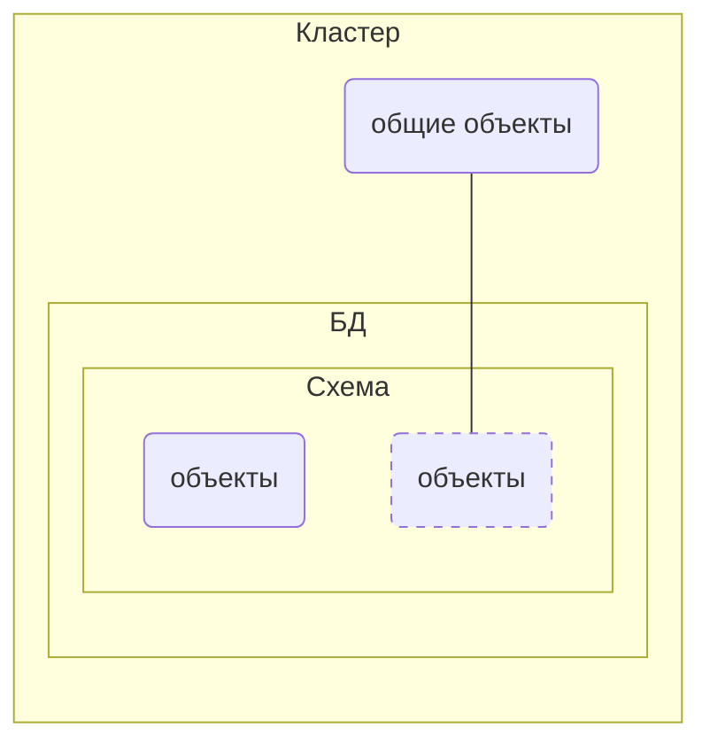

# Логическая организация

**объекты** - таблицы, индексы и т.п.

## Шаблоны
- При инициализации кластера создается 3 базы данных
  - `template0` - базовая, неизменяемая (восстановление, кодировка)
  - `template1` - изменяемая, клон `template0`
  - `postrges` - бд по умолчанию
- Новая БД всегда клонируется из существующих

## Схемы и пути поиска
- Пространсво имен для объектов
  - расперделение объектов на логические группы
  - предотворащение конфликта имен между приложениями
- Схема и пользователь - разные сущности (хотя могут быть одноименными)
- Специальные схемы
  - `public` - по умаолчанию в ней создаются все объекты
  - `pg_catalog` - [системный каталог](#системный-каталог)
  - `information_schema` - вариант системного каталога
  - `pg_temp` - для временных таблиц
  - ...

**Определение схемы**:
- явное (`схема.имя`)
- неявное (`search_path`)
`pg_temp`, `pg_catalog` - невно включаются первыми, если `search_path` (`current_schemas(true)`) не указан

## Системный каталог
- Содержит описание всех объектов кластера
  - набор таблиц в каждой бд 
  - несколько глобальных объектов
  - набор представление для удобства
- названия таблиц начинается с `pg_`
- имена столбцов содержат трехбуквенные префиксы
- в качестве ключа используется `oid`
- названия объектов храняться в нижнем регистре

# Физическая организация

- данные распределяются по табличным пространствам (каталогам)
- объект представлен несколькими слоями
- каждый слой состоит из одного или нескольких файлов сегментов

## Табличные пространства и каталоги
- Данные разбиты по табличныи пространствам (ТП) - местоположенме файлов в ФС
- по умолчанию создаються `pg_default`(`PGDATA/global/`) и `pg_global`(`PGDATA/base/`)
- `pg_global` - хранит информацию системного каталога
- Одно ТП может использоваться разынми БД
- Одна БД может хранить данные в разных ТП
- Люая БД использует `pg_default`, если не сконфигурировано обратное
- На кастомные пути создается символьная ссылка в `PGDATA/pg_tblspc/`
- Файлы с данными называются **сегментами** (до 1ГБ)

## Слои (данные, карты видимости и свободного пространства)
- Каждому объекту соответсвует несколько *слоев* (forks)
- Слой - набор сегментов (т.е. один или несколько файлов)
- Сегменты(файлы) - разбиты на страницы (по 8КБ)

Типы:
- Основной слой - собственно данные (версии строк таблиц или строки индексов)
- Карта видимости (vm) - отмечает страницы, на которых все версии строк видны во всех снимках (страницы с актуальными версиями строк)
- Карта свободного пространства (fsm) - в страницах после очистки (доступное место внутри страниц)

## Технология TOAST (The Oversized Attributes Storage Technique)
- Версия строки должна помежаться на одну страницу
  - можно сжать часть аттрибутов
  - вынести в отдельную TOAST-таблицу
  - сжать и вынести одновременно

- Данные больше размера страницы помещаються в отдельную служебную таблицу
- Такая отделная таблица создается для каждой основной таблицы
- Информация храниться в `pg_toast`
- данные в TOAST-таблице должны быть не больше размера одной страницы -> большие данные нарезаються на страницы 
